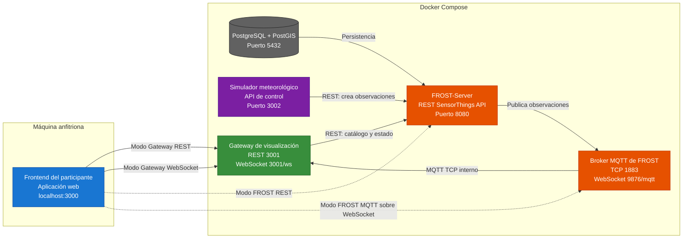

# Arquitectura del proyecto

El proyecto está compuesto por servicios ejecutándose en Docker Compose y un
frontend web desarrollado por los participantes del taller.

## Flujo de datos

1. El simulador genera observaciones meteorológicas y las registra en FROST mediante REST.
2. FROST persiste los datos en PostgreSQL/PostGIS y publica las nuevas observaciones en MQTT.
3. El Gateway consume FROST mediante REST y MQTT, y expone una API REST y un WebSocket para el frontend.
4. El frontend puede consumir los datos a través del Gateway o directamente desde FROST mediante REST y MQTT sobre WebSocket.

## Puertos principales

| Servicio | Puerto | Uso |
|---|---:|---|
| Frontend | `3000` | Aplicación web del participante |
| Gateway | `3001` | REST y WebSocket `/ws` |
| Simulador | `3002` | Panel y API para eventos de tormenta |
| FROST REST | `8080` | API SensorThings `/FROST-Server/v1.1` |
| FROST MQTT | `1883` | MQTT TCP para servicios internos |
| FROST MQTT-WebSocket | `9876` | MQTT para navegadores en `/mqtt` |
| PostgreSQL/PostGIS | `5432` | Persistencia de FROST |

Las conexiones directas del navegador a FROST utilizan REST en el puerto `8080`
y MQTT sobre WebSocket en `ws://localhost:9876/mqtt`. El puerto MQTT TCP `1883`
se utiliza para las conexiones internas de Docker y no para el navegador.
